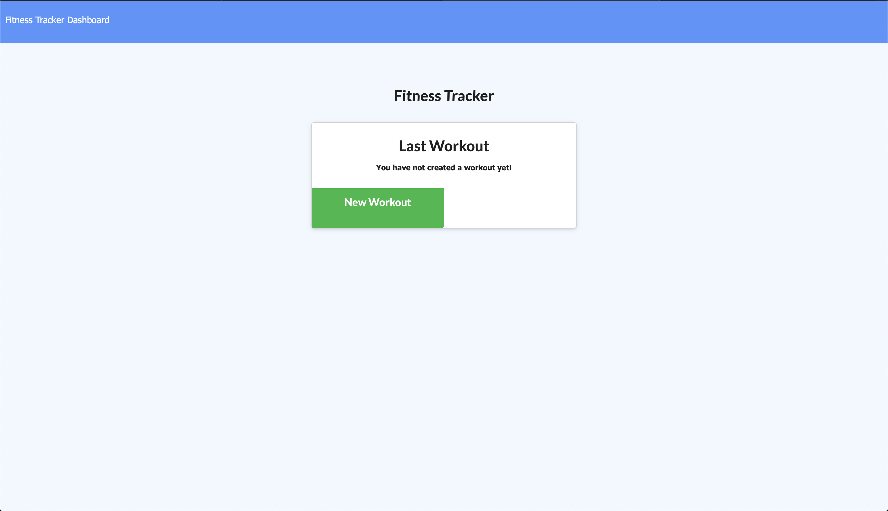
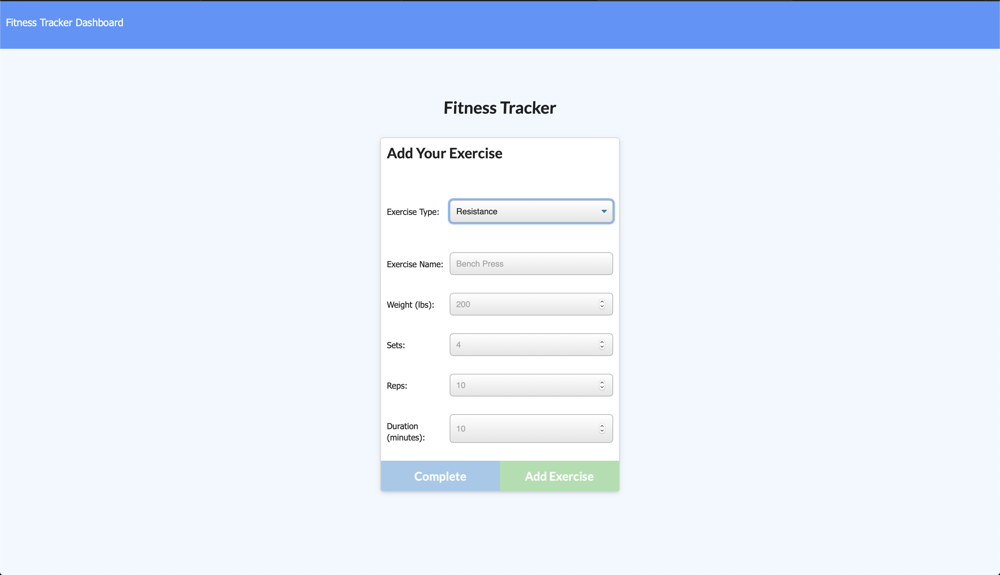

# WorkoutTracker

## Descripition
A fitness app that allows the user to view, create, and track daily workouts. The user is able to log multiple exercises in a given day and also go back and update the workout. The user is able to track the name, type, weight, sets, reps and duration of each exercise. Cardiovascular exercises show the distance traveled in miles.

## Installation

1. Clone repository. 
2. npm install
3. node server.js

Running seeders/seed.js is optional to have a prepopulated database.

## Usage

### Screeshots

1. Example 1

2. Example 2

